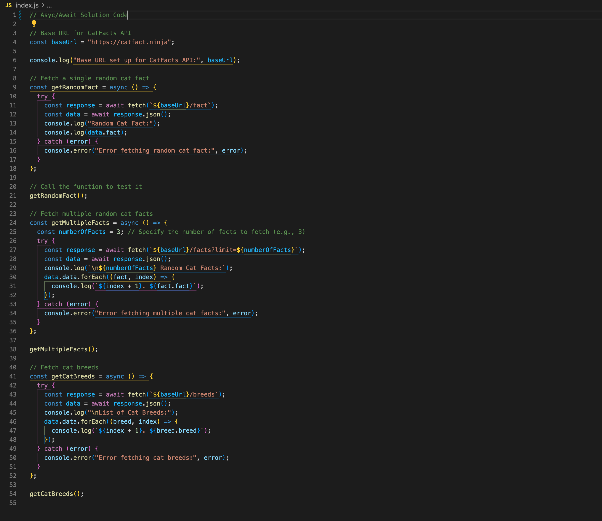

# Fetch with Async/Await: Working with APIs in JavaScript



---

## Description 📄

JavaScript's **fetch API** combined with **async/await** syntax enables developers to handle **asynchronous operations** more readably and maintainably than with promises alone. By awaiting fetch requests, we ensure that our code is easy to follow while still being non-blocking, allowing JavaScript to continue other tasks while waiting for data retrieval.

In this lab, we’ll refactor our previous code that used promises to make it more streamlined by using **async/await**. You’ll learn how to:

- **Retrieve data** from a web API with HTTP requests.
- **Handle responses** efficiently by parsing JSON and managing success or failure scenarios.
- **Display fetched data** directly in the console.
- Use async/await to handle **chained API requests** more clearly and effectively.


The lab demonstrates how to use **fetch** to interact with the **CatFacts API**, covering tasks like requesting a single cat fact, retrieving multiple cat facts, and a list of cat breeds. Understanding how to fetch data and handle responses using async/await is essential for creating efficient, data-driven JavaScript applications.

To explore the API's available endpoints and features, visit the [CatFacts API website](https://catfact.ninja/). This site offers details on how to use various endpoints, including fetching a single random cat fact, retrieving multiple facts, and listing cat breeds.

## Expected Project Structure 🏗️
Your project should be structured as follows:

```plaintext
aisd-ajs-02-fetch-async/
├── index.js
└── README.md
```

##

## Instructions ✅

### 1. **Fork and Clone the Lab Repository**
   - [ ] Fork the repository for this lab to your GitHub account.

   - [ ] Clone the forked repository to your local machine to get started.

   - [ ] Open the cloned repository and locate the `index.js` file provided from the previous lab assignment. This file includes the starter code that you will refactor using async/await.
   
##

### 2. **Setting Up the Base URL for Fetch Requests**

In this lab, we’ll use the same **base URL** and **endpoints** as in the previous assignment to interact with the **CatFacts API**. Let’s set up the base URL to streamline our API requests, so you can easily reference different endpoints without repeating the full URL each time. This setup simplifies your code and makes future updates more manageable.

- [ ] Keep the following code currently in your `index.js` file:

    ```javascript
    // Base URL for CatFacts API
    const baseUrl = "https://catfact.ninja";

    console.log("Base URL set up for CatFacts API:", baseUrl);
    ```

**Explanation:**

- **Setting the Base URL:** This `baseUrl` variable stores the base address of the **CatFacts API**. You’ll use this URL as a starting point for various requests to the API, making your code cleaner and easier to maintain. Here are the endpoints you’ll be working with:

  - **`/fact`**: Returns a single random cat fact.
  - **`/facts`**: Fetches multiple cat facts at once. Add `?limit=3` as a query parameter to get three facts, for example.
  - **`/breeds`**: Provides a list of cat breeds, including descriptions and other details.

  Each endpoint extends from the `baseUrl`, allowing you to target specific data from the API based on your needs. You can explore more on how each endpoint works by visiting the [CatFacts API documentation](https://catfact.ninja/).

- **Easier Maintenance:** Defining `baseUrl` in one place means you only have to update it once if the API’s main address changes, rather than in every single fetch request.

- **Preparation for Fetch Requests:** This base URL setup keeps your API calls **consistent** and easy to reference, so that as you proceed with writing fetch requests, you only need to append the specific endpoints to this base URL.

##


